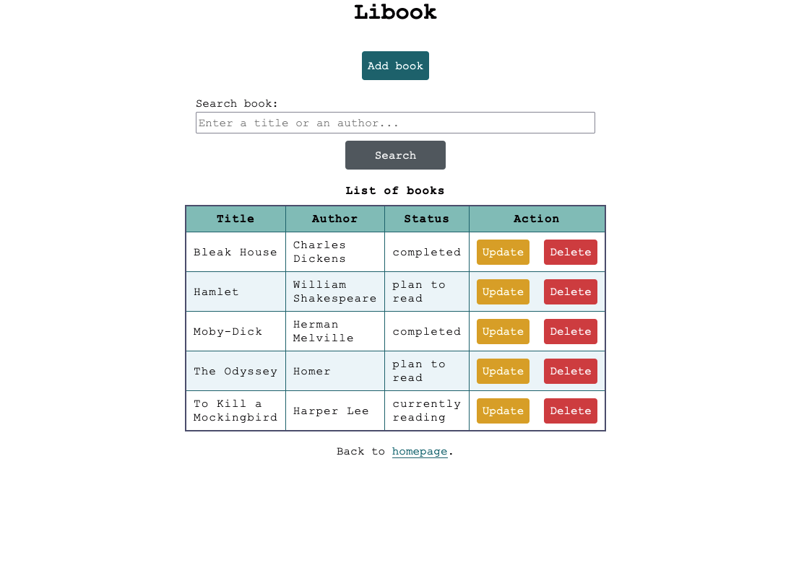

# Libook



An application which helps to manage books.

## Running

The easiest way to run application is using Docker.

**Prerequisites**:

- [Docker](https://www.docker.com)
- Configuration file `.env` (see: [.env.example](.env.example))

```shell
docker-compose up
```

Application should be available on port `8080`.
