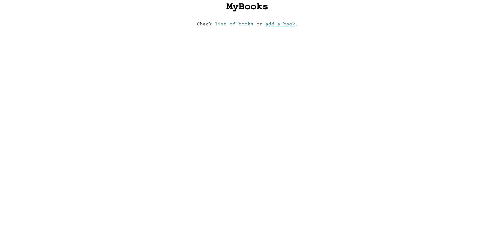

# libook



## Run Application

1. Create `.env` file, see [.env.example](.env.example).
2. Run the following command to build and start containers:

```shell
docker-compose up
```

Application should be available at [localhost on port 8080](http://localhost:8080).